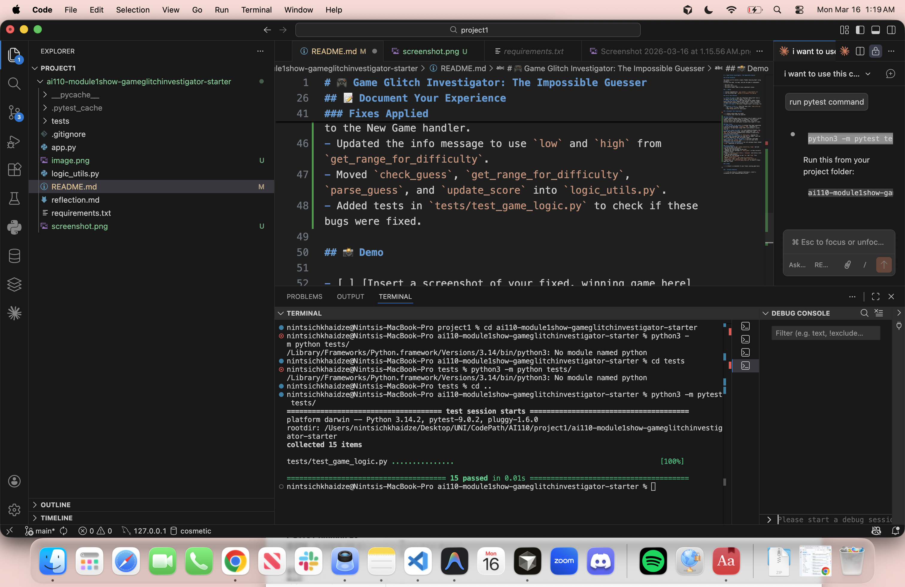

# 🎮 Game Glitch Investigator: The Impossible Guesser

## 🚨 The Situation

You asked an AI to build a simple "Number Guessing Game" using Streamlit.
It wrote the code, ran away, and now the game is unplayable. 

- You can't win.
- The hints lie to you.
- The secret number seems to have commitment issues.

## 🛠️ Setup

1. Install dependencies: `pip install -r requirements.txt`
2. Run the broken app: `python -m streamlit run app.py`

## 🕵️‍♂️ Your Mission

1. **Play the game.** Open the "Developer Debug Info" tab in the app to see the secret number. Try to win.
2. **Find the State Bug.** Why does the secret number change every time you click "Submit"? Ask ChatGPT: *"How do I keep a variable from resetting in Streamlit when I click a button?"*
3. **Fix the Logic.** The hints ("Higher/Lower") are wrong. Fix them.
4. **Refactor & Test.** - Move the logic into `logic_utils.py`.
   - Run `pytest` in your terminal.
   - Keep fixing until all tests pass!

## 📝 Document Your Experience

- [ ] Detail which bugs you found.
- [ ] Explain what fixes you applied.

### Game Purpose
A number guessing game where the player tries to guess a secret number within a limited number of attempts. The difficulty setting controls the range and attempt limit. The player receives hints after each guess to guide them higher or lower.

### Bugs Found
1. **Wrong range on New Game** — clicking "New Game" generated a secret using hardcoded `randint(1, 100)` regardless of difficulty, so Hard mode (range 1–50) could produce a secret like 76.
2. **String comparison bug** — on even-numbered attempts, the secret was cast to a string, causing comparisons like `"9" > "80"` to be evaluated alphabetically instead of numerically, producing wrong outcomes.
3. **Swapped hint messages** — `check_guess` returned "Go HIGHER!" when the guess was too high and "Go LOWER!" when too low — the opposite of what the player needs.
4. **Status not reset on New Game** — starting a new game didn't reset the `status` field, so a won/lost game would immediately stop the new game.
5. **Range display hardcoded** — the info message always showed `1-100` regardless of difficulty.

### Fixes Applied
- Fixed New Game to use `random.randint(low, high)` derived from the selected difficulty.
- Removed the even-attempt string cast.
- Swapped the hint messages in `check_guess` so they correctly guide the player.
- Added `st.session_state.status = "playing"` and history reset to the New Game handler.
- Updated the info message to use `low` and `high` from `get_range_for_difficulty`.
- Moved `check_guess`, `get_range_for_difficulty`, `parse_guess`, and `update_score` into `logic_utils.py`.
- Added tests in `tests/test_game_logic.py` to check if these bugs were fixed.  

## 📸 Demo

## 🚀 Stretch Features

- [ ] [If you choose to complete Challenge 4, insert a screenshot of your Enhanced Game UI here]
